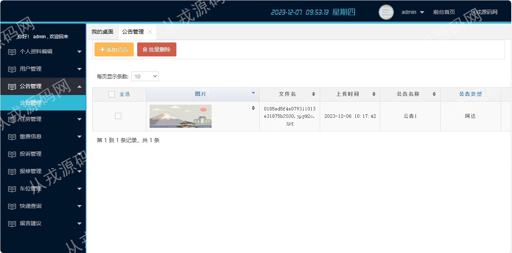
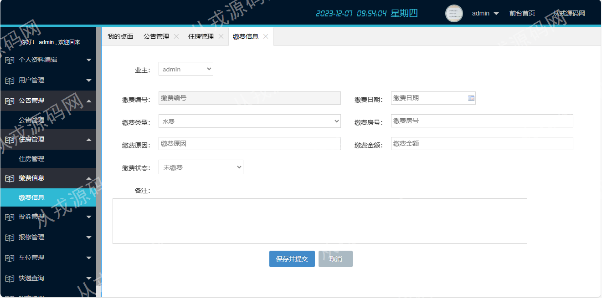
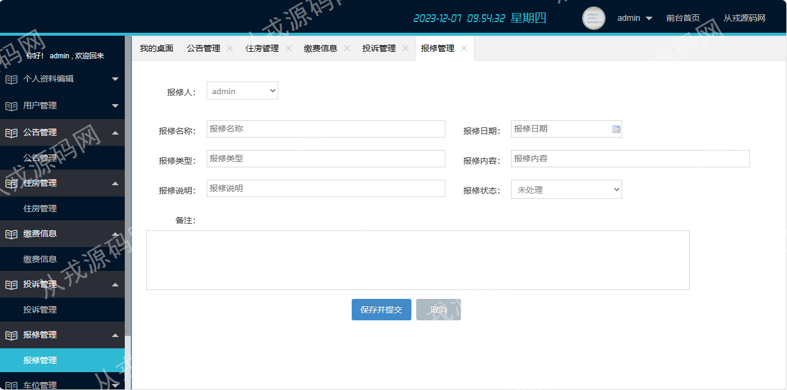

<h1 align="center">52.基于ssm的小区物业管理系统</h1>

- <b>完整代码获取地址：从戎源码网 ([https://armycodes.com/](https://armycodes.com/))</b>
- <b>技术探讨、资料分享，请加QQ群：692619798</b> 
- <b>作者微信：19941326836  QQ：952045282</b> 
- <b>承接计算机毕业设计、Java毕业设计、Python毕业设计、深度学习、机器学习</b>
- <b>选题+开题报告+任务书+程序定制+安装调试+论文+答辩ppt 一条龙服务</b>
- <b>所有选题地址 ([https://github.com/YuLin-Coder/AllProjectCatalog](https://github.com/YuLin-Coder/AllProjectCatalog)) </b>

## 项目介绍
基于ssm的小区物业管理系统：前端jsp、jquery、layer.js，后端 spring、mybatis，集成公告管理、住房管理、缴费管理、投诉管理、包修管理、车位管理、快递查询等功能于一体的系统。

## 功能介绍

- 公告管理：管理员发布公告、选择公告图片上传和下载、公告内容编辑、不需要的公告内容进行删除
- 住房管理：住房的增删改查，录入住房信息时自动带出业主列表可供选择，填入楼宇名称、迁入时间、房号、建筑面积等关键信息
- 缴费管理：缴费信息的增删改查，支持批量删除，缴费时下拉框选择业主，缴费类型分为水费、电费、燃气费、停车费、物业费，缴费房号、缴费金额、缴费状态为关键信息
- 投诉管理：投诉信息的增删改查，投诉人、投诉标题、投诉日期、投诉类型、投诉内容、投诉状态等
- 报修管理：报修信息的增删改查，支持批量删除，报修人员选择、报修名称、报修日期、报修类型、报修内容、报修状态，报修状态可以区分是否师傅已上面维修过
- 车位管理：车位信息的增删改查，支持批量删除，业主选择、车位号、录入日期、车位类型、车位位置、车位价格等
- 快递管理：快递信息的增删改查，快递公司、单号、收货人、地址等信息的录入，状态为已签收和未签收，业主取完快递，更改状态为已签收
- 留言建议：留言建议信息的增删改查，留言人、留言内容、留言日期，留言回复
- 用户管理：用户信息的增删查改，支持批量操作、对已有用户可以进行停用和启用操作，停用用户不能再登录系统，日志列表、批量删除日志
- 个人信息：个人信息查看和修改，用户操作日志查询

## 环境

- <b>IntelliJ IDEA 2009.3</b>

- <b>Mysql 5.7.26</b>

- <b>Tomcat 7.0.73</b>

- <b>JDK 1.8</b>

## 运行截图

